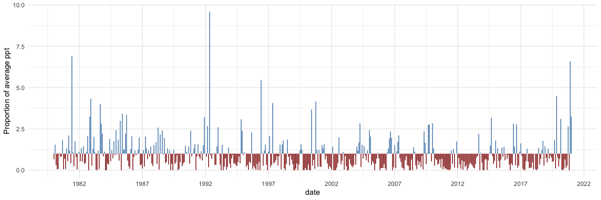
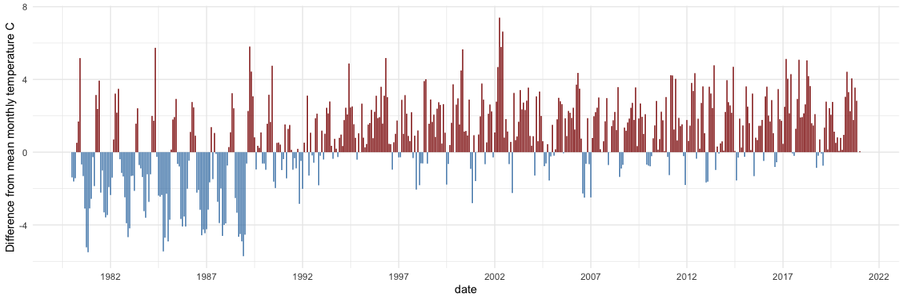
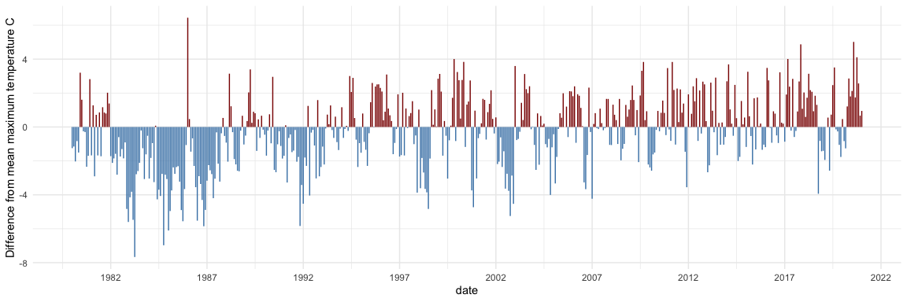
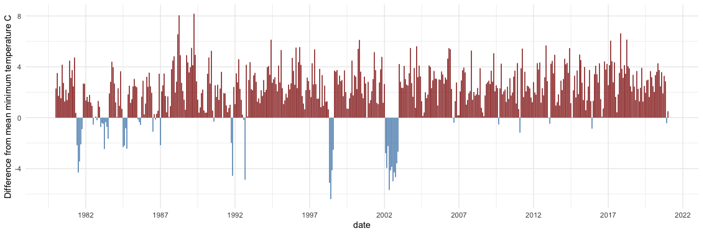
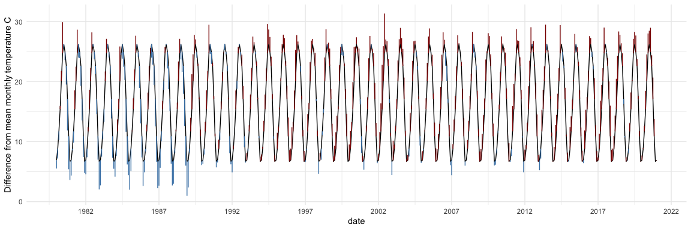
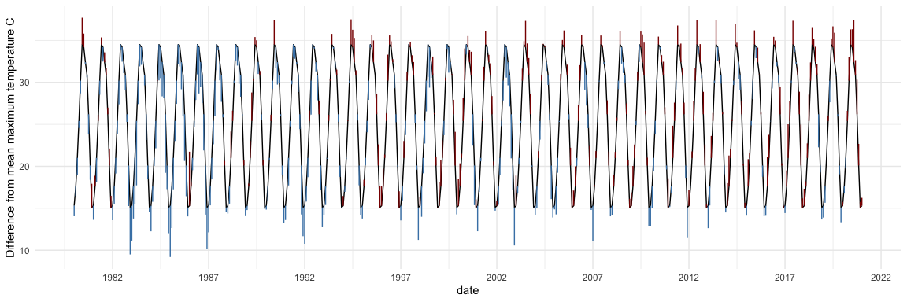

Climate\_Anomaly
================
Glenda Yenni
1/22/2021

### Climate anomalies using PRISM 30-year mean data (1981 - 2010)

### Precipitation

<!-- -->

### Mean Temperature

<!-- -->

### Maximum Temperature

<!-- -->

### Minimum Temperature

<!-- -->

### With Raw Temperature Time Series Data

<!-- -->

<!-- -->
