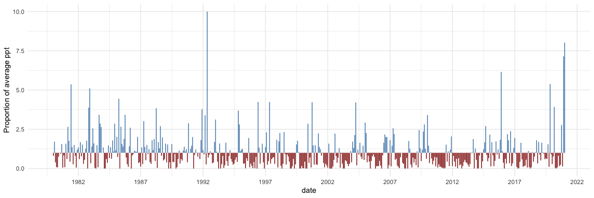
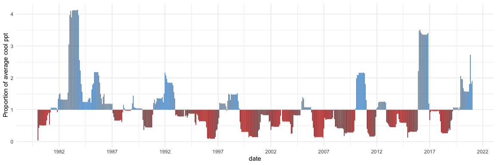
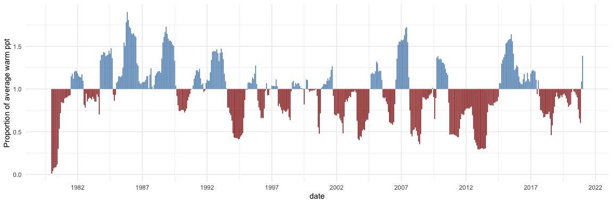
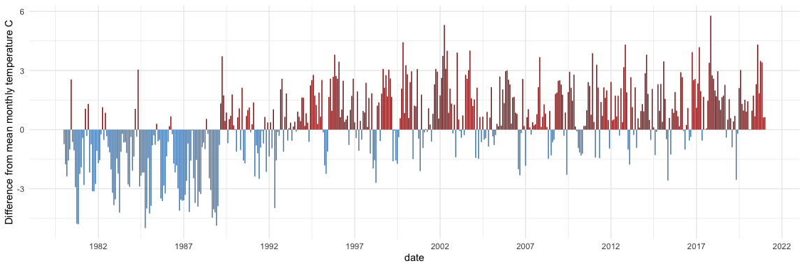
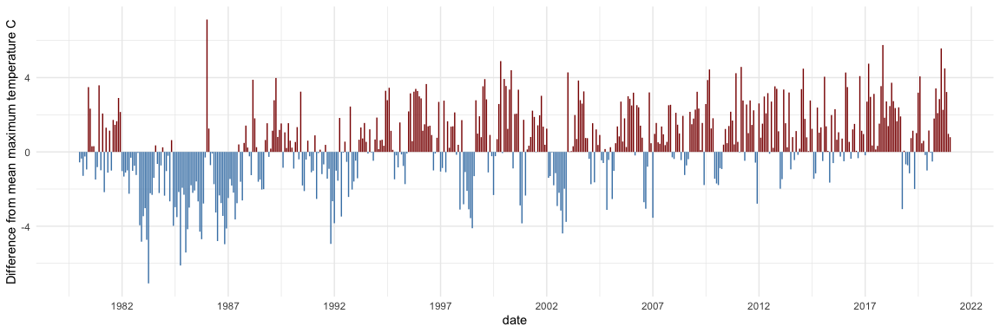
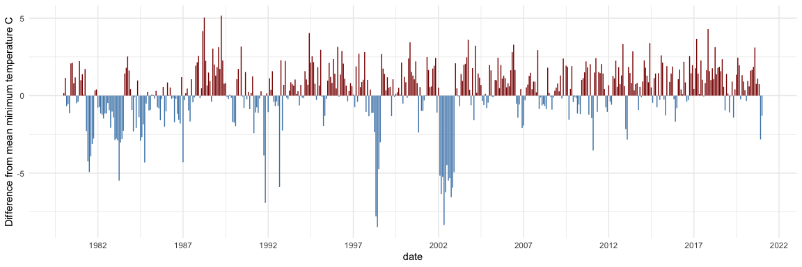
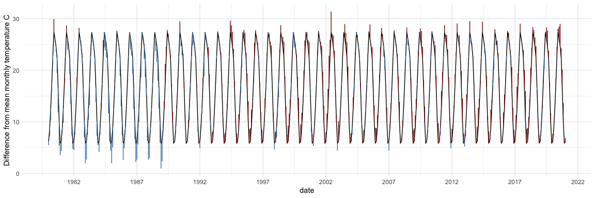
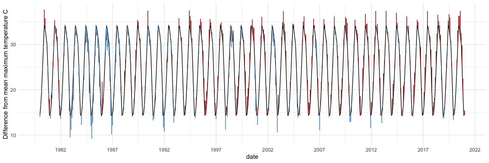

Drought and temperature change
================
Glenda Yenni
1/25/2021

### Local climate anomalies using local 30-year mean data (1980 - 2010)

### Precipitation

‘Warm’ and ‘cool’ precipitation are 365-day rolling sums of total
precipitation that falls during warm (above 4C minimum, no chance of
freezing) or cool (below 4 C minimum) periods, respectively.

<!-- --><!-- --><!-- -->

### Mean Temperature

<!-- -->

### Maximum Temperature

<!-- -->

### Minimum Temperature

<!-- -->

### With Raw Temperature Time Series Data

<!-- -->

<!-- -->
