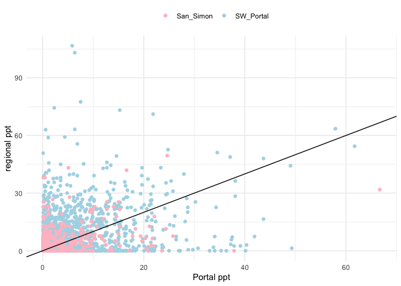
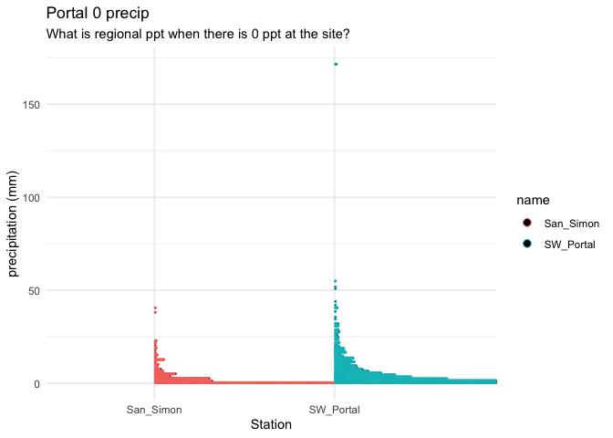
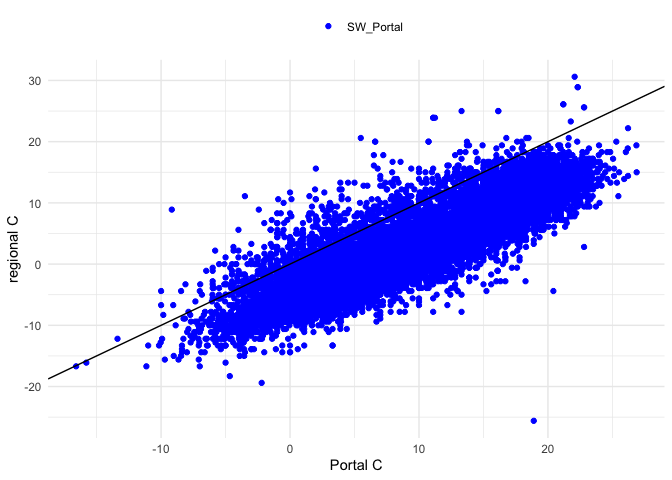
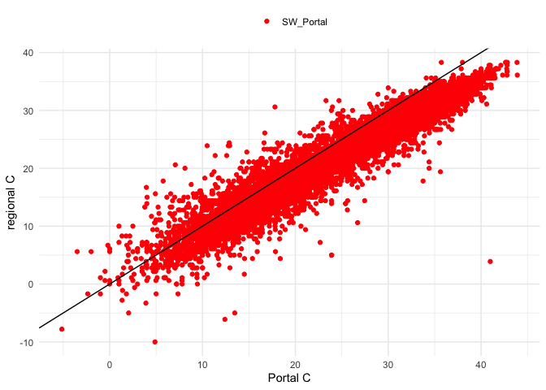

Regional Weather
================
Glenda Yenni
4/15/2020

Patterns in precipitation, temperature, and ndvi

## Local vs regional weather stations

### Precipitation

Looking at zeros separately, since they are most
values

<!-- --><!-- -->

### Minimum Temperature

We only have temperatures from SW\_Portal

<!-- -->

### Maximum Temperature

We only have temperatures from SW\_Portal

<!-- -->
